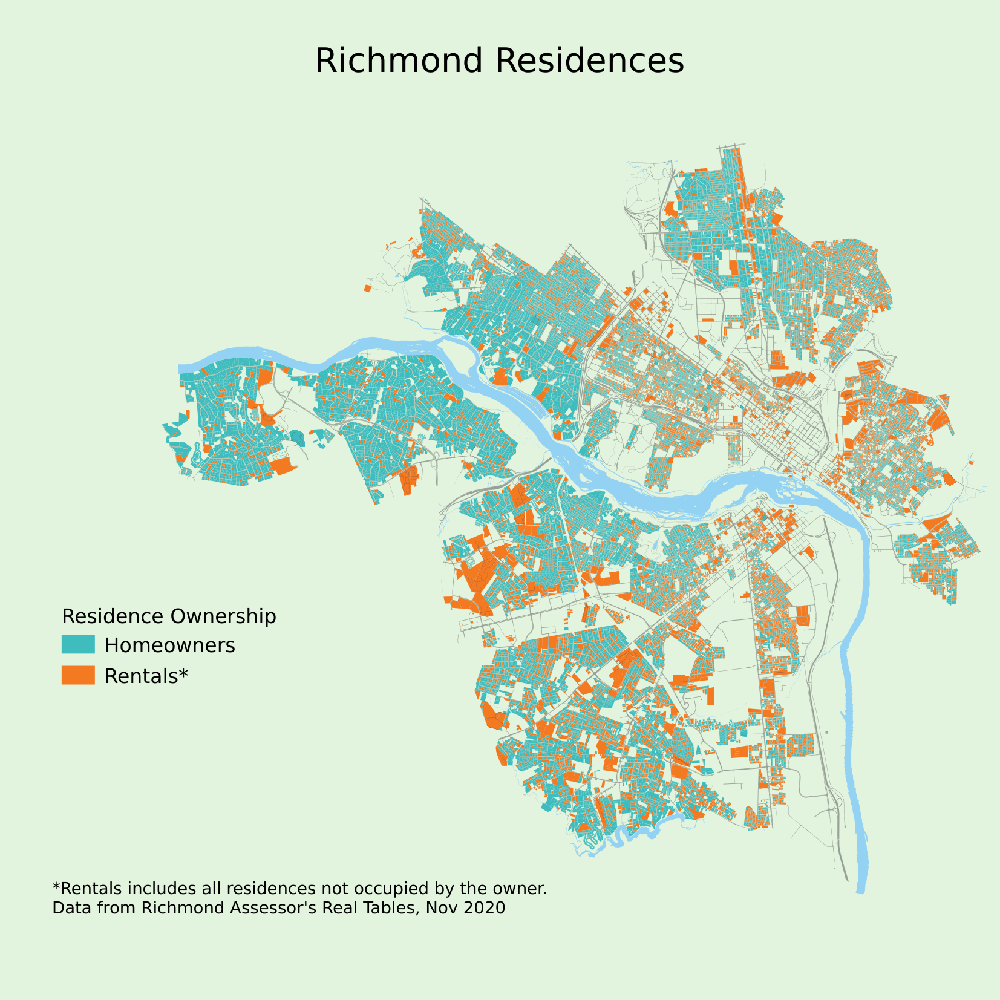

# Ownership of Homes in Richmond VA

## Introduction

My goal with this project is to explore home ownership. I'm using public property assessment data to compare the owner's mailing address with the physical address, which seems like a novel approach. 

## Result Previews

The primary outcome is this map of residential parcels in the city, grouped into 2 categories ('resOwner' field in the data). The blue parcels are homes where the property owner's mailing address matches the parcel street address. This seems like a good indication of an owner-occupied property - a homeowner. The orange parcels don't have matching addresses, which includes several possibilities: long-term rental homes, vacation rentals (e.g. AirBNB), family tenants (e.g. home owned by resident's parent), second homes, non-traditional mailing addresses (e.g. P.O. box, or attorney). Most of the large orange parcels are apartment buildings.

This whole project was inspired by something [Damon Harris](https://twitter.com/ThatsDame) of [Teal House Company](https://www.tealhousecompany.com/) said in a talk. Afterward, he wondered how this map would look with a [redlining map](https://dsl.richmond.edu/panorama/redlining/) overlayed on it, so I gave it a try, with predictably depressing results. These grades were assigned by the Home Owner's Loan Corporation (HOLC) in 1937, mostly based on racial composition. Over 80 years later, you can see that areas with a grade of A still have a 91% homeownership rate, while areas rated D have 55% homeownership. See below for more details about my process - and please note that this is an estimated percentage of buildings which are owned by the residents, not the percentage of people who own their home. I'm still working on that one.

I was curious about whether there were patterns to out-of-state ownership, so I also categorized the rental parcels by how far away the owner's mailing address was. A slight majority were elsewhere in Richmond (58%), while 38% lived elsewhere in Virginia, and 11% were located out of state.

## Data sources

The City of Richmond Assessor's Office has a public data set of property ownership files. The primary source for ownership is the "Real Estate Master File". You can [read more about them and access XLSX files at their site](https://www.rva.gov/assessor-real-estate/data-request). Text/CSV files have historically been available at the FTP site: ftp://ftp.ci.richmond.va.us/Assessor/Real%20Tables/

For mapping the ownership of parcels, you'll also need the [Parcels](https://richmond-geo-hub-cor.hub.arcgis.com/datasets/parcels-1/) GIS file. See [here for more City of Richmond GIS resources](https://www.rva.gov/information-technology/geographic-information-systems), including the [Basemap](https://richmond-geo-hub-cor.hub.arcgis.com/search?tags=basemap) files.

The HOLC 1937 Areas GIS layer comes from the [Mapping Inequality](https://dsl.richmond.edu/panorama/redlining/#loc=13/37.549/-77.514&city=richmond-va) project at the University of Richmond.

## Data products

**all_res_own.csv** - contains my calculated fields for the parcels; can be joined to the Parcels vector layer based on the PIN

**holc_ric_groups_2284.geojson** - I reprojected the HOLC layer from Mapping Inequality into EPSG:2284 to match the Parcels layer, and grouped the polygons into one entity for each HOLC Grade.

QGZ files - these are GQIS project files for each map I've made so far.

## Process

See my Jupyter Notebook file (ownership.ipynb) for the technical details of creating the all_res_own.csv file.

### all_res_own.csv fields

#### resOwner

Using the Real Estate Master File, I calculated a new field "resOwner" based on whether the MailAddr and LocAddr matched - 1 if yes, 0 if no. This was not easy, since they're often formatted very differently. For example, parcel N0051081001 has a MailAddr of "3201 FIFTH AVE" and a LocAddr of "3201 5TH AVE". I experimented with standardizing both fields to the same format, but it's a tedious process. Eventually, I settled on a simple approach of testing whether the first 4 characters of the addresses match each other. Parcels which were classified as apartments were all set to 0.

#### ownerDistance

This field was calculated based on whether the mailing address' city == "RICHMOND", whether the mailing address' state == "VA", or otherwise.

#### curr_own_len

(This and the following field were based on the Property Transfers file.) 

How many days has the parcel been owned by the current owner?

#### avg_own_len

The mean number of days that the past 3 owners each held the property for.

### QGIS fields

#### holc_ric_groups_2284.own_perc

This field is the ownership % for each HOLC grade. For the **holc_ric_groups_2284** layer, I added this field with this QGIS calculation:

    aggregate('residence_rent_vs_own',
        'mean',
        all_res_own_resOwner,
        filter:=(intersects(geometry(@parent),$geometry))
        )

In other words, calculate the mean value of **resOwner** for each parcel contained within the group of polygons that defines this HOLC grade.

Note that each apartment building counts as 1 parcel, so this statistic is not a good estimate of the percentage of *people* who own the building they live in; it's the percentage of buildings which are owned by people living there.